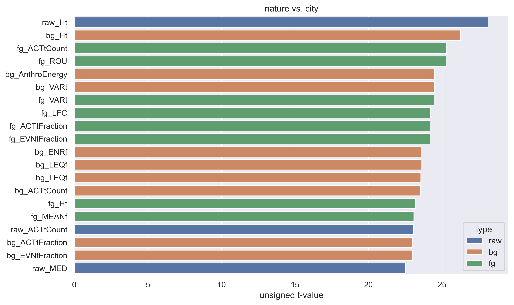
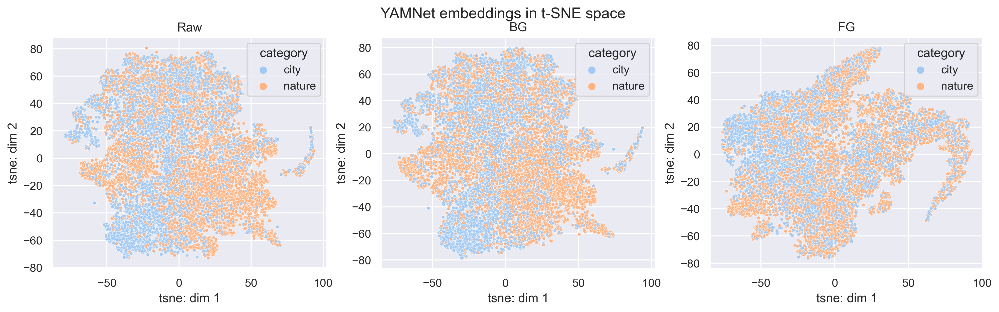
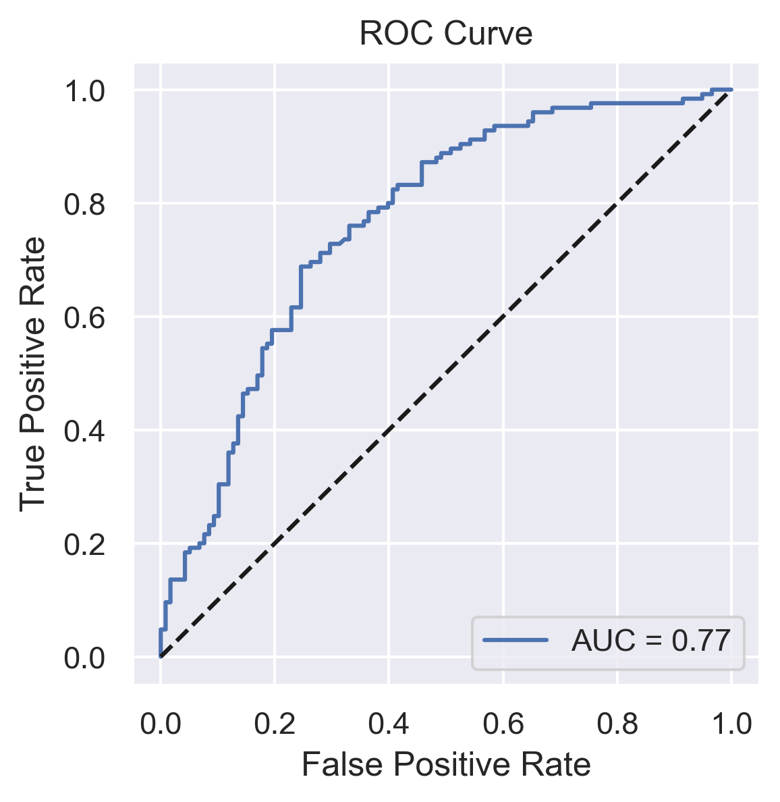

# Classifying the Acoustic Environment of YouTube Videos using Deep Neural Networks

**Deep neural network model combining audio signal processing and pre-trained audio CNN achieved 90.1% adjusted accuracy (27.6% improvement) for classifying audio recording environment.**

## 0. Introduction & Goal

Deep learning has proven to be effective in various machine listening applications such as identifying audio events (e.g., dog barking, car honking), speech recognition (e.g., “Hey Siri”), and music information retrieval (e.g., beat tracking, source separation). These audio events are typically considered as the “foreground” of the sound and are often contaminated by various types of background noise, such as ambient noise (e.g., street noise, wind noise, other people talking) or acoustic factors present in the recording environment (e.g., reverberation and frequency absorption).

While most audio deep learning models focus on enhancing foreground sound and removing background noise, information about the background acoustic environment can be valuable in identifying the surrounding scene, monitoring environments and soundscapes (e.g., noise pollution, biodiversity), and further aiding foreground signal enhancement (e.g., preparing a cell phone to remove background street noise once someone speaking on a phone is identified in a city). 

**The objective of this project is to develop a deep neural network that can classify the environment in which the audio was recorded as either urban or natural.**

## 1. Data: Google AudioSet

[Google AudioSet](https://research.google.com/audioset/) is a vast, freely available, labeled audio dataset that contains 2.1 million human-annotated 10-second sound clips sourced from YouTube videos. Among these, 34,343 clips are labeled as “[Outside, urban or man-made](https://research.google.com/audioset///dataset/outside_urban_or_manmade.html)“, while 35,731 clips are labeled as “[Outside, rural or natural](https://research.google.com/audioset///dataset/outside_rural_or_natural.html)“.

For this project, a total of 6,862 audio recordings from natural environments and 6,564 from urban environments were sampled as the training dataset, with an additional 118 nature and 125 city recordings being used for the final testing dataset.

### 1-1. Why this dataset?

Compared to other audio datasets that focus on recording environmental soundscapes, training a deep learning model on AudioSet is both more useful and more challenging for several reasons:

1. AudioSet is a challenging yet useful dataset for deep learning models: AudioSet presents a challenge for deep learning models due to the various recording settings and editing methods used in YouTube audios. However, this diversity can also make the model more robust, which is practical for potential users who may input audio with different recording settings.

2. Different emphases on audio signals in YouTube videos and the current project. While foreground sounds like speech and events are typically emphasized in most YouTube videos, this project prioritizes background sounds as they are more informative, while foreground sounds are not as important.

A few screenshots of YouTube clips from Google AudioSet. The clips in the top row are labeled as “Outside, urban or manmade” and the bottom row as “Outside, rural or natural”.

### 1-2. Labels were about 80% accurate

Although Google AudioSet offers a large quantity of files, the quality of its labeling is known to be subpar. To assess the labeling accuracy of our dataset, I randomly selected 100 files (50 urban/city and 50 rural/nature) and evaluated whether they were correctly labeled (see [here](notebooks/0-3_re-evaluate_AudioSet_labels.ipynb)). The results indicated that the labeling accuracy ranged from 64-84%. Therefore, I assume that the maximum classification accuracy of the dataset is around 80%.

## 2. Signal Processing Pipeline

[Jupyter notebook: Signal processing pipeline](notebooks/1_signal_proc_pipeline.ipynb)

Each audio signal was processed in the following steps:

1. Loads the 10-second audio signal at a sampling rate of 16k and converts it to mono using `librosa`.

2. Normalizes the root-mean-square of the entire signal to 0.1.

3. Uses `noisereduce` to segregate foreground (FG) and background (BG) audio signals. The following steps apply to each of the original (RAW), FG and BG signal.

4. Uses `scikit-maad`, a package for quantifying environmental audio recordings, to extract the indices in both time and frequency domains (e.g., Bioacoustics Index, Acoustic Complexity Index) for each signal.

5. Uses `soundsig` to calculate the spectrotemporal modulation power spectrum, which is essentially a 2D Fourier transformation of the audio spectrogram and is relevant to animal calling and human auditory perception.

## 3. Convert Audio Signals to Pre-trained CNN Embeddings ##

[Jupyter notebook: CNN embeddings](notebooks/3_embeddings_extraction.ipynb)

The audio signals are being converted to pre-trained convolutional neural network (CNN) embeddings, which will be used for classification tasks.

Three popular pre-trained CNN models for classifying audio events have been selected: **VGGish** (256 embeddings), **YAMNet** (1024 embeddings), and **PANNs** (2048 embeddings). They were all pre-trained by Google AudioSet.

YAMNet as an exemplar architecture of a pre-trained CNN model for categorizing sound events. Adapted from [Giordano et al. (2023) Nature Neuroscience](https://doi.org/10.1038/s41593-023-01285-9)

## 4. Exploratory Data Analysis

[Jupyter notebook: Exploratory data analysis](notebooks/4_exploratory_data_analysis.ipynb)

The goal of exploratory data analysis is to examine the extent to which there are differences between audio recordings from urban and natural environments across (1) soundscape indices, (2) spectrotemporal modulation power, and (3) embeddings generated by pre-trained audio CNN models.

### 4-1. Soundscape indices

Independent t-test was applied on each of the 60 soundscape indices of each raw, BG, and FG signals to examine whether any of them are different between urban and natural categories.

Of the top 20 indices with the largest unsigned t-values, 9 were based on BG signal, 8 were based on FG signal, and 3 were based on RAW signal. Moreover, the indices that showed the greatest differences between urban and natural categories varied across signals. This suggests that the separation of BG and FG signals is effective and that both types of signal contain valuable information for classification.

I also used linear correlation to inspect whether there are any associations among the indices. Obviously, some indices have high correlations. Therefore, **the dimensionality of the soundscape indices’ data can be significantly reduced before applying deep learning.**

### 4-2. Spectrotemporal modulation power spectrum (MPS)

The heatmaps of t-values reveal that the audio recordings obtained in urban and rural/natural environments exhibit distinct spectrotemporal modulation patterns. A few noteworthy observations can be made:

- Raw, BG, and FG demonstrate similar but different patterns of significance, indicating that signal segregation is functioning as intended.
- It is evident from the heatmaps that certain clusters exist. Therefore, again, it may be worthwhile to consider **dimensionality reduction** prior to applying deep learning techniques.

### 4-3. CNN model embeddings

Since each pre-trained CNN model transforms an audio signal into high-dimensional embeddings (VGGish: 128, YAMNet: 1024, PANNs: 2048), it can be challenging to use traditional statistics to evaluate the differences between audio recordings from urban and natural environments. However, **t-SNE** (t-distributed stochastic neighbor embedding) is a useful approach for visualizing high-dimensional data and can provide insight into the separation of the data.

There was only weak segregation between the two sets of data in t-SNE space. It would require a deep learning model to perform a more effective classification.

## 5. PCA Dimensional Reduction

[Jupyter notebook: PCA](notebooks/5_PCA_aggregation.ipynb)

According to the exploratory data analysis above, audio recordings from urban and natural environments exhibit some differences across soundscape indices, spectrotemporal modulation power, and embeddings generated by pre-trained audio CNN models, suggesting that these features hold promise for training a deep learning classifier. However, the large number of features may lead to the **“curse of dimensionality”**. To address this issue, I will use **principal component analysis (PCA) to reduce the dimensionality of the data** before proceeding with deep learning.

The number of PCs applied to each set of features corresponds to approximate 95-99% of the variance of each dataset:

- Soundscape indices: 60 → 20
- MPS: 101*77 → 10
- VGGish embeddings: 256 → 128
- YAMNet embeddings: 1024 → 400
- PANNs embeddings: 2048 → 400

The data in the PC space was also norm-scaled before proceeding with deep learning.

## 6. Deep Neural Network

[Jupyter notebook: Deep Neural Network](notebooks/6_deep_learning.ipynb)

A deep neural network (more specifically, **multilayer perceptron, MLP**), built by Keras and Tensorflow will be used to classify audio recordings as either urban or natural environments. The following plans have been made:

- Use the **BayesianOptimization hyperparameter tuning** procedure to search for the best depth of the model, number of units at each layer, learning rate, and activation function.
- To avoid overfitting, insert a dropout layer will between any two layers, and also tune the dropout rate.
- Since pre-trained CNN models such as VGGish, YAMNet, and PANNs may represent similar information, use only the embeddings of one model at a time, along with features of soundscape indices and the MPS.
- Train a deep neural network on the features of each of the RAW, BG, and FG signals, as well as on the joint features of these three signals.
- Select area under the curve (AUC) as the goal metrics as it represents the degree of separability between two categories.

### 6-1. Hyperparameter tuning

In short, the deep learning model that combines PANNs embeddings, soundscape indices, and the MPS of raw audio signals outperforms the other models, with AUC = 0.806.

It is interesting to note that the performance of the models using all three signals, RAW only, and BG only were equally good. This finding supports the idea that the FG signal is not relevant to the goal of this model, as the models based on FG had the worst performances. However, surprisingly, the BG signal is not more informative than the raw signal. It is possible that pre-trained CNN models are already effectively segregating FG and BG signals, and it may be unnecessary to use noisereduce at the beginning.

## 6-2. Build a model with the best parameters

This is the architecture of the best deep learning model:

Here are the plots of model training history by epochs. The model became overfit when the number of epoch reached approximate 60. The best epoch was #46 and the validation AUC of the best epoch was 0.801.

### 6-3. Final evaluations

**The test AUC is 0.766!**

It is only 0.035 lower than the validation AUC. This suggests that the overfitting rate is very low and the model’s classification performance is excellent (AUC > 0.75).

The raw maximum classification accuracy of this model was 0.721. However, as mentioned above, the label accuracy of this dataset is not optimal, and the ceiling classification accuracy of the current dataset is assumed to be 80%. Therefore, **the current classification accuracy should be adjusted to 0.721/0.8 = 90.1%**, which is excellent.

## 7. Visualization and Interpretation

[Jupyter notebook: Visualization & Interpretation](notebooks/7_visualization_interpretation.ipynb)

The final goal is to visualize and interpret which features are most crucial in classifying audio recording environments. To explain the degree to which a particular feature influences the classification outcome, SHAP will be utilized.

### 7-1. SHAP

[SHAP](https://shap.readthedocs.io/en/latest/) (SHapley Additive exPlanations) is a game theoretic approach to explain the output of any machine learning model. The SHAP approach explores how much the model prediction will change by adding each variable, which provides an insight into the contribution of each variable in the model’s output.

As all the features have been transformed into PC-space to reduce the number of dimensions before training a deep learning model, the SHAP results consist of PCs of the soundscape indices (`indices_XXX`), spectrotemporal modulation power spectrum (`mps_XXX`), and embeddings of the PANNs model (`panns_XXX`). 

**Among the top 20 critical features, there are 3 PCs of soundscape indices, 2 PCs of spectrotemporal modulation spectrum, and 15 PCs of PANNs embeddings.**

The finding suggests that the audio CNN model (i.e., PANNs) pre-trained on a large sample is highly effective for transfer learning in classifying audio environments. However, the features obtained via a hypothesis-driven signal processing approach remain useful, indicating that combining these two approaches could enhance the model’s performance even further.

### 7-2. Convert PCs back to original features

In this stage, the weights of the critical PCs of the soundscape indices and spectrotemporal modulation spectrum identified by SHAP will be mapped to the original features. This mapping will enable us to inspect the critical original features and gain a better understanding of their importance in the model’s output.

Please note that since the embeddings of the PANNs model are not explainable, we will skip this conversion step for PANNs.

The plots reveal that the **low frequency region in both the spectral and temporal modulation domains is critical for accurately classifying audio environments**. This finding is also supported by the exploratory data analysis, which revealed that the t-test identified the most significant group difference in the same region. This is not surprising since this frequency range is more prevalent in the acoustic world, such as in speech, music, machine sounds, and animal calls, and therefore, these features are informative for classification purposes.

Regarding the soundscape indices, the top 15 original features were showed in the plot. This finding is consistent with numerous previous studies. For example, the zero-crossing rate (`ZCR`) has been an essential feature in machine listening, including speech recognition and music information retrieval. The acoustic complexity index (`ACI`) is useful for quantifying environmental noise levels. Additionally, acoustic activity indices, in both temporal (`ACTtMean`, `ACTtCount`) and spectral (`ACTspCount`, `ACTspMean`) domains, are popular for quantifying the audio signal that reaches a certain threshold.

Interestingly, the deep learning model’s top features do not completely overlap with the most significant features identified by t-tests during exploratory data analysis. For example, the SHAP ranked ZCR and ACI as the most important feature for the current deep learning model, while t-tests did not rank them in the top 20 features. This suggests that the top features may be contributing to classification in a nonlinear manner. For more in-depth explanations and references of soundscape indices, please visit [`scikit-maad`](https://scikit-maad.github.io/features.html).

## 8. Conclusions

A deep neural network model was built by combining the features obtained from audio time series signal processing and the pre-trained audio CNN models, for classifying various YouTube videos recorded in either urban or natural environments.

The evaluation testing **AUC was 0.766** (baseline 0.5), the **overfitting level was 0.035**, and the **adjusted accuracy was 0.901** (baseline 0.5). These results suggest that the current model has an excellent performance with a low overfitting rate.

While the embeddings obtained from the pre-trained audio CNN model (PANNs) were dominant in contributing to the model’s output, the contributions of traditional signal processing features cannot be neglected either. Among all features, the zero-crossing rate, acoustic complexity index, and low-frequency spectrotemporal modulations are highly informative for classifying sounds being recorded in urban or natural environments.

## 9. Future Directions

This project demonstrates that a deep neural network model can effectively identify the acoustic background of an audio recording. However, there are several potential directions for further improvement and development.

Improving the dataset with more accurate and diverse environmental labels can further refine the model, making it more practical for classifying different acoustic environments, such as small rooms or cars. Additionally, combining the model’s features with other audio recognition models and feeding them into a generative large language model, such as GPT, can lead to a semantic summary of the audio recording, providing useful insights such as “*a girl buying a hotdog in a basketball stadium while people cheer for the Lakers.*”

